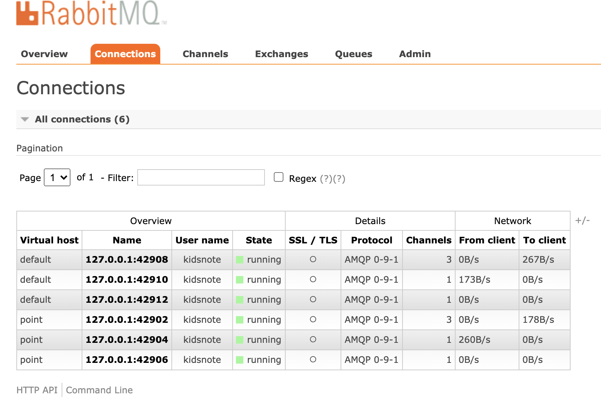
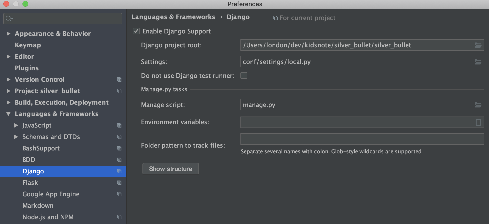
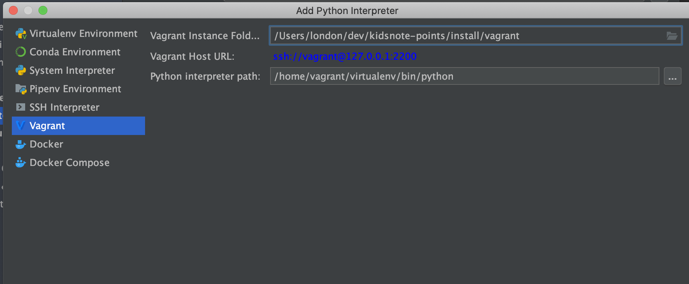
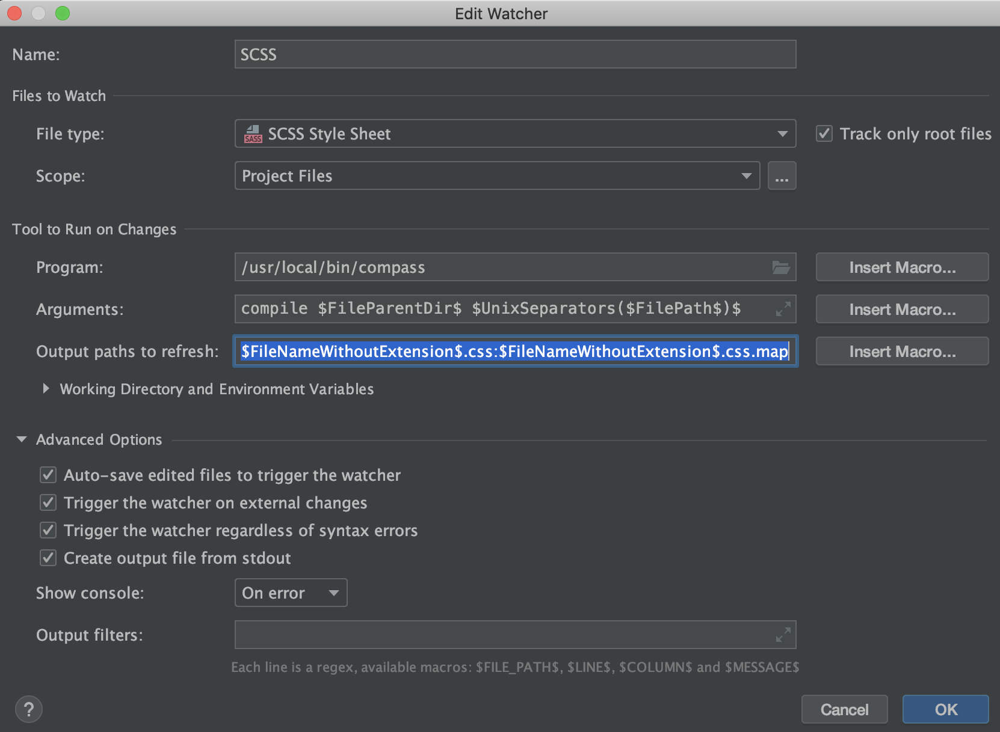
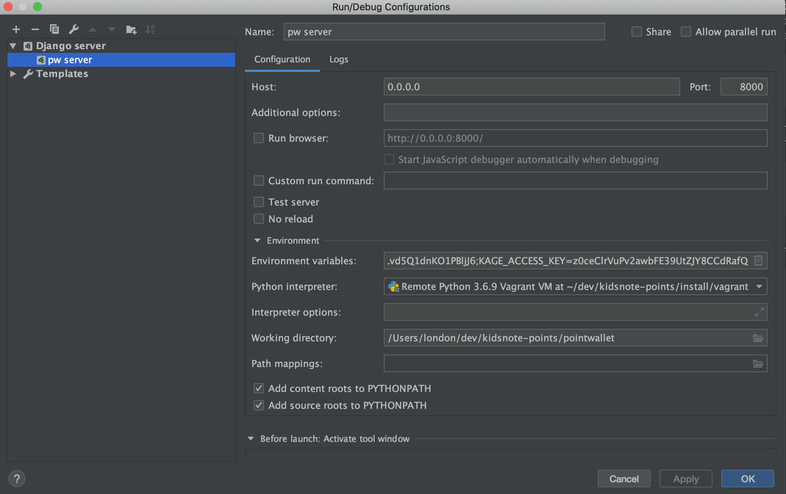

## 맥에서 작업 해야 할 것
 - 맥에서 vagrant 설치 ( 검색해서 )
 
 - git source
 ```
 cd ~
 mkdir dev
 cd dev
 git clone ~ 
 cd install/vagrant/
 
 ```
 
 - 가상머신 설치 
 ```
 vagrant up 
 ```
 
 - 네트워크 설정
 ```
 sudo vi /etc/hosts
 192.168.10.10 local-study.django.com
 ```
 
 - 가상머신 접속
 ```
 vagrant ssh
 ```
 
 

## 설치 후 작업

### mariadb 서버 설정
```
sudo vi /etc/mysql/mariadb.conf.d/50-server.cnf 
bind-address            = 0.0.0.0
sudo service mysqld restart
```

### install python package

```
vagrant 내에서 패키지 설치 할 것
```

### setting django local.py
```
해당 사항 없음 
```

### 마이그레이션

```
cd ~/code/project
python3 manage.py migrate --database=default
```

### Seed 생성
```
해당사항 없음
```

### worker 실행
```
추후 설정 추가
```

### rabbitmq 
http://local-study.django.com:15672/

kidsnote // kidsnote



## Pycharm 설정 with vagrant

### Support django



### 1. interpreter 설정 (Vagrant)



### 2. File Watcher - SCSS


```
Program : /usr/local/bin/compass
Arguments : compile $FileParentDir$ $UnixSeparators($FilePath$)$
output paths : $FileNameWithoutExtension$.css:$FileNameWithoutExtension$.css.map
```

### Root Source 로 지정
- 화면 왼쪽 Project 탭에서 study 디렉토리 클릭 후 "Mark Direct AS" => Root Source

### Django Server 추가


```
Host : 0.0.0.0 
Port : 8000
Environment variables: PYTHONUNBUFFERED=1;DJANGO_SETTINGS_MODULE=conf.settings.local;KAGE_SECRET_KEY=2FJcEUckQqw7QRR9C0lv3Htw1TqmlMAuCSjDrDPk3ySDZWSLvd5Q1dnKO1PBljJ6;KAGE_ACCESS_KEY=z0ceClrVuPv2awbFE39UtZJY8CCdRafQ
```

### http://local-study.django.com:8000 접속 확인


### Vagrant 명령어 
```
vagrant ssh : 쉘 접속
vagrant sanpshot : 스냅샷 저장
vagrant suspend : 일시중지
vagrant resume : 일시중지를 다시 진행으로

```

#### 초기 셋팅이 끝났으면 스냅샷으로 찍어 놓자
- vagrant sanpshot save "init_stage"


